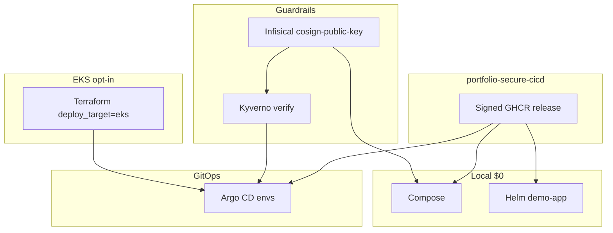

# portfolio-cloud-platform

[](https://github.com/sauravrana646/portfolio-cloud-platform/actions/workflows/ci.yml)

> Platform deploy pack: run a **signed** app image from [`portfolio-secure-cicd`](https://github.com/sauravrana646/portfolio-secure-cicd) on Compose → Helm → Argo CD → optional EKS, with Kyverno admission and Infisical-backed cosign verify.


## Demo in 15 minutes

```bash
# Pull digest-pinned signed image (no local app build)
docker compose up -d
curl -s http://127.0.0.1:8080/healthz   # {"status":"ok"}

# Optional: verify cosign sig + SPDX attestation (Infisical public key)
# make verify-image

# OrbStack / existing cluster
make cluster-deploy
kubectl -n demo port-forward svc/demo-api 8080:80
make cluster-down
```

Or: `./scripts/demo.sh`

## Division of responsibility

| Concern | Repo |
|---------|------|
| Build, Trivy, promotion, cosign **sign**, SBOM, GHCR release | [portfolio-secure-cicd](https://github.com/sauravrana646/portfolio-secure-cicd) |
| Digest pin, Infisical **verify**, Helm/Argo/EKS, Kyverno | **This repo** |

Pinned release (example): `ghcr.io/sauravrana646/portfolio-secure-cicd@sha256:a407de4528243789ae9784099afbca03e066dcb9092f05f9ef3060b23145f1e3` (`v0.1.0`).

## Architecture



## Stack

| Layer | Choice |
|-------|--------|
| Workload image | Signed `portfolio-secure-cicd` from GHCR (digest pin) |
| Local | Docker Compose |
| K8s | Helm chart + Argo CD App-of-Apps |
| Platform Helm deps | Kyverno, Infisical secrets-operator, metrics-server |
| Policy | Kyverno ClusterPolicies (digest, non-root, cosign verify) |
| Secrets | Infisical Operator sync + CI OIDC for cosign **public** key |
| IaC | Terraform `local` \| `eks` (no ECS) |
| Observability | Prometheus + Grafana (Compose) |
| CI | Helm lint/template/kubeconform + Terraform fmt/validate/plan; sticky PR comment; optional Infisical cosign verify + EKS plan via `AWS_ROLE_ARN` |

## Cost

| Path | Cost |
|------|------|
| Compose / local Helm | ~$0 |
| Infisical Free (verify identity) | $0 within free tier |
| EKS sandbox | Control plane ~$70–75/mo + node; **no NAT** by default; destroy when done |

See `docs/PLATFORM_IMPROVEMENT_PLAN.md` and `infra/terraform/README.md`.

## Security notes

- Non-root pod security contexts in the chart
- Kyverno policies under `policy/kyverno/`
- Cosign verify uses Infisical (`devops-portfolio-x-k3-y` / `/cosign` / `cosign-public-key`) — never private keys here
- **Do not `terraform apply` without sandbox approval**

## Hire me for…

**K8s Deploy Pack / platform path** — [sauravrana646@gmail.com](mailto:sauravrana646@gmail.com) · [github.com/sauravrana646](https://github.com/sauravrana646)
