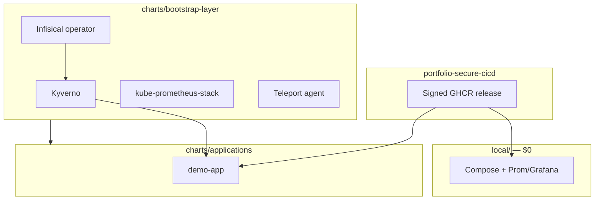

# portfolio-cloud-platform

[](https://github.com/sauravrana646/portfolio-cloud-platform/actions/workflows/ci.yml)

> Platform deploy pack: run a **signed** app image from [`portfolio-secure-cicd`](https://github.com/sauravrana646/portfolio-secure-cicd) on Compose → Helm → Argo CD → optional EKS, with Kyverno admission and Infisical-backed cosign verify.


## Layout

```text
local/                         # $0 laptop demo (Compose + Prom/Grafana + Kind config)
charts/
  bootstrap-layer/             # prerequisite charts (Kyverno, prom-stack, …)
  applications/                # workload charts (demo-app)
helm-values/                   # mirrors charts/ — values only
  bootstrap-layer/
  applications/demo-app/environments/{dev,uat,prod}/
argocd/                        # root App + ApplicationSet (auto from charts/)
policy/kyverno/                # admission policies (referenced by bootstrap chart)
infra/terraform/               # local | eks
```

## Demo in 15 minutes

```bash
make up
curl -s http://127.0.0.1:8080/healthz   # {"status":"ok"}

# Optional: verify cosign sig + SPDX attestation (Infisical public key)
# make verify-image

make cluster-deploy
kubectl -n demo port-forward svc/demo-api 8080:80
make cluster-down
```

Or: `./scripts/demo.sh`

## Division of responsibility

| Concern | Repo |
|---------|------|
| Build, Trivy, promotion, cosign **sign**, SBOM, GHCR release | [portfolio-secure-cicd](https://github.com/sauravrana646/portfolio-secure-cicd) |
| Digest pin, Infisical **verify**, Helm/Argo/EKS, Kyverno | **This repo** |

## Architecture



## Stack

| Layer | Choice |
|-------|--------|
| Local | `local/docker-compose.yml` |
| Bootstrap charts | Kyverno, kube-prometheus-stack, metrics-server, Infisical operator, Teleport |
| Apps | `charts/applications/demo-app` |
| Values | `helm-values/` (mirrors charts) |
| GitOps | Argo CD ApplicationSet over `charts/` |
| JIT | Teleport (`docs/JIT_TELEPORT.md`) |
| IaC | Terraform `local` \| `eks` |

See `argocd/README.md`, `helm-values/README.md`, `docs/architecture.md`.

## Hire me for…

**K8s Deploy Pack / platform path** — [sauravrana646@gmail.com](mailto:sauravrana646@gmail.com) · [github.com/sauravrana646](https://github.com/sauravrana646)
