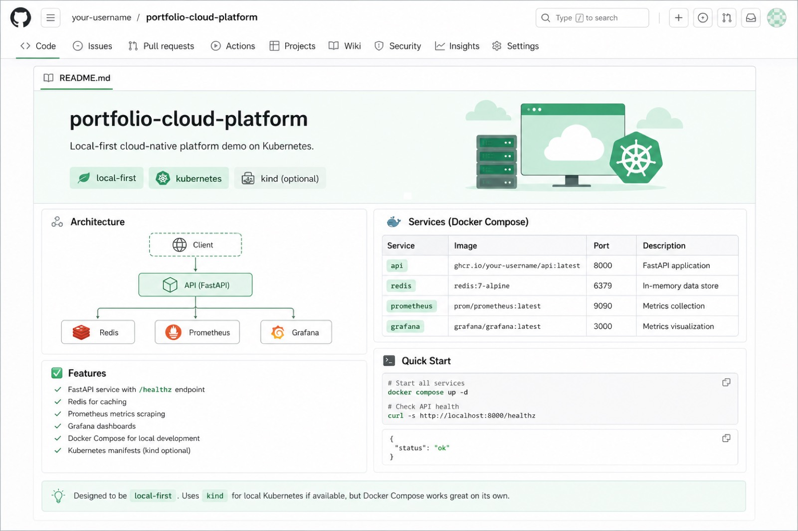
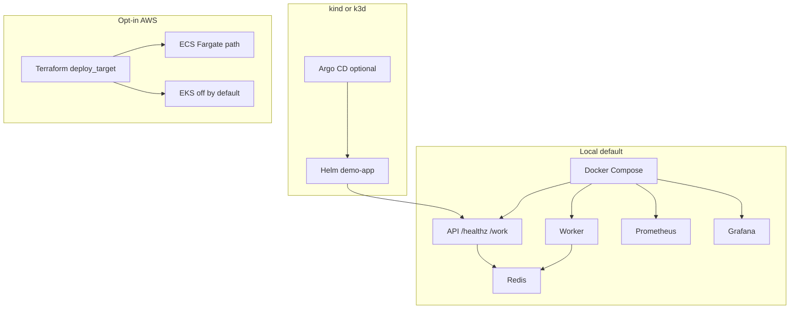

# portfolio-cloud-platform

[](https://github.com/sauravrana646/portfolio-cloud-platform/actions/workflows/ci.yml)

> Production-ready app platform patterns on AWS + Kubernetes — local-first with Compose/Helm (OrbStack or any kubecontext), cloud-optional via Terraform (`ecs` cheap path; `eks` off by default).



## Demo in 15 minutes

```bash
# Compose (no cluster required)
docker compose up --build -d
curl -s http://127.0.0.1:8080/healthz   # {"status":"ok"}
curl -s http://127.0.0.1:8080/work

# OrbStack / existing cluster (uses current kubectl context)
make cluster-deploy
kubectl -n demo port-forward svc/demo-api 8080:80
# curl http://127.0.0.1:8080/healthz
make cluster-down
```

## Problem this solves for a startup

You need a real deploy path (API + worker + observability + CI) without standing up an expensive EKS cluster on day one.

## Architecture



## Stack

| Layer | Choice |
|-------|--------|
| App | Python Flask API + Redis worker |
| Local | Docker Compose |
| K8s | Helm chart + optional Argo CD |
| IaC | Terraform ≥1.5 (`local` / `ecs` / `eks`) |
| Observability | Prometheus + Grafana (compose) |
| CI | GitHub Actions + Trivy |

## Prerequisites

- Docker / Docker Compose
- Optional: Helm, kind/k3d, Terraform 1.5+

## Quickstart (≈15 minutes)

```bash
docker compose up --build -d
curl -s http://127.0.0.1:8080/healthz
curl -s http://127.0.0.1:8080/work
# Grafana http://127.0.0.1:3000 (admin / admin)
# Prometheus http://127.0.0.1:9090

# Helm lint
helm lint charts/demo-app

# Terraform validate (no cloud resources with default)
cd infra/terraform && terraform init -backend=false && terraform validate
```

### kind path

```bash
make kind-load   # requires kind cluster + helm
```

## What was automated

- Compose stack with healthchecks
- CI: unit tests, image + Trivy, helm lint, terraform validate
- Deploy target switch for future cloud

## Security notes

- Non-root containers
- Trivy CRITICAL fails CI
- No secrets in repo; OIDC deploy stub commented in workflow
- **Do not `terraform apply` without sandbox approval**

## Cost estimate / teardown

Local demo cost: ~$0 (your machine).

```bash
docker compose down -v
# If you ever applied cloud resources:
# cd infra/terraform && terraform destroy
```

EKS is intentionally off by default — prefer kind + optional ECS.

## Hire me for…

**K8s Deploy Pack / platform path** — [sauravrana646@gmail.com](mailto:sauravrana646@gmail.com) · [github.com/sauravrana646](https://github.com/sauravrana646)
