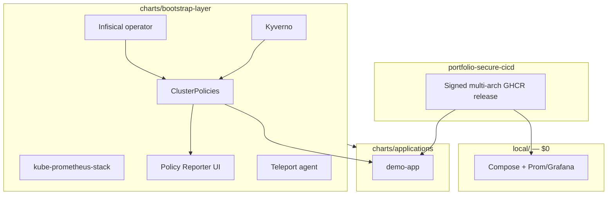

# portfolio-cloud-platform

[](https://github.com/sauravrana646/portfolio-cloud-platform/actions/workflows/ci.yml)

> Platform deploy pack: run a **signed multi-arch** app image from [`portfolio-secure-cicd`](https://github.com/sauravrana646/portfolio-secure-cicd) on Compose → Helm → Argo CD → optional EKS, with Kyverno admission, Infisical-backed cosign verify, and Policy Reporter UI.


## Layout

```text
local/
  docker-compose.yml           # $0 API + Compose Prom/Grafana
  bootstrap/                   # Kind e2e: Kyverno, policies, prom-stack, demo-app
charts/
  bootstrap-layer/             # Kyverno, prom-stack, Infisical, Policy Reporter, …
  applications/                # workload charts (demo-app)
helm-values/                   # mirrors charts/ — values only
argocd/                        # per-env roots + ApplicationSets (explicit file lists)
policy/kyverno/                # admission policies (referenced by bootstrap chart)
infra/terraform/               # local | eks
```

## Demo in 15 minutes

```bash
# Path A — Compose ($0, no cluster)
make up
curl -s http://127.0.0.1:8080/healthz   # {"status":"ok"}

# Path B — Kind full platform (Kyverno + policies + monitoring + app)
make bootstrap-up
make bootstrap-status
# Grafana http://127.0.0.1:30030  Prometheus http://127.0.0.1:30090
make bootstrap-down
```

Or: `./scripts/demo.sh`

## Local Kubernetes setup (OrbStack + Argo CD)

End-to-end guide when Argo CD is already installed on OrbStack: Infisical
**Universal Auth**, bootstrap root (Kyverno, monitoring, policies, **Policy Reporter**),
env roots (`dev` / `uat` / `prod`), and digest-pinned `demo-app`.

→ **[`docs/LOCAL_K8S_ORBSTACK.md`](docs/LOCAL_K8S_ORBSTACK.md)**

Pinned release today: **`portfolio-secure-cicd` `v0.2.0`** (linux/amd64 + linux/arm64).

## Division of responsibility

| Concern | Repo |
|---------|------|
| Build, Trivy, promotion, cosign **sign**, SBOM, multi-arch GHCR release | [portfolio-secure-cicd](https://github.com/sauravrana646/portfolio-secure-cicd) |
| Digest pin, Infisical **verify**, Helm/Argo/EKS, Kyverno, Policy Reporter | **This repo** |

## Architecture



## Stack

| Layer | Choice |
|-------|--------|
| Local Compose | `local/docker-compose.yml` |
| Local OrbStack + Argo | [`docs/LOCAL_K8S_ORBSTACK.md`](docs/LOCAL_K8S_ORBSTACK.md) |
| Local Kind e2e | `local/bootstrap/` (`make bootstrap-up`) |
| Bootstrap charts | Kyverno, policies, Policy Reporter UI, kube-prometheus-stack, metrics-server, Infisical operator, Teleport |
| Apps | `charts/applications/demo-app` (RO rootfs + `/tmp` emptyDir) |
| Values | `helm-values/` (mirrors charts) |
| GitOps | Per-env Argo roots + ApplicationSets (explicit `files:`) |
| JIT | Teleport (`docs/JIT_TELEPORT.md`) |
| IaC | Terraform `local` \| `eks` |

See `argocd/README.md`, `helm-values/README.md`, `docs/architecture.md`, `docs/RUNBOOK.md`.

## Hire me for…

**K8s Deploy Pack / platform path** — [sauravrana646@gmail.com](mailto:sauravrana646@gmail.com) · [github.com/sauravrana646](https://github.com/sauravrana646)
