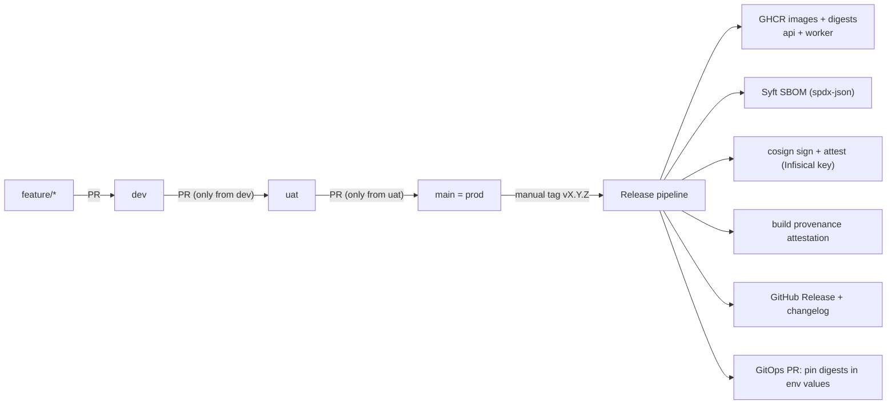
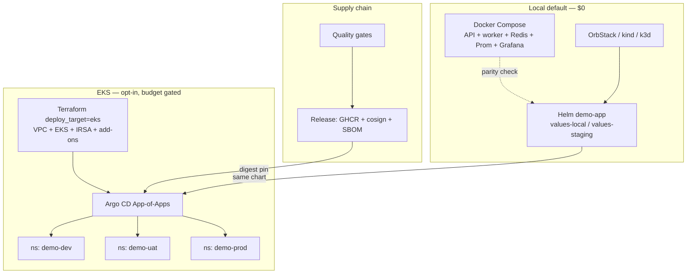

# CI/CD & Platform Improvement Plan — portfolio-cloud-platform

This plan is written to be executed by a separate agent (or incremental PRs) in `sauravrana646/portfolio-cloud-platform`. Scope is **local-first + EKS**. **ECS is out of scope** and should be removed or archived from the Terraform path as part of this work.

Sibling reference: the promotion / signed-release model in [`devops-portfolio` `docs/CICD_IMPROVEMENT_PLAN.md`](https://github.com/sauravrana646/devops-portfolio/blob/main/docs/CICD_IMPROVEMENT_PLAN.md) (applied there to `portfolio-secure-cicd`). This plan reuses that promotion + supply-chain model and extends it with a real **Compose → Helm (local cluster) → GitOps → EKS** deploy path, which is the point of *this* repo.

---

## Context (current state)

Repo `sauravrana646/portfolio-cloud-platform` today:

| Area | Current state | Gap vs enterprise |
|------|---------------|-------------------|
| App | Flask API (`app/api`) + Redis worker (`app/worker`); Redis list `jobs` | Worker/Redis not in Helm; no worker tests |
| Local | `docker-compose.yml`: API, worker, Redis, Prometheus, Grafana | No pinned Compose project name/network policies; Grafana admin/admin |
| Helm | `charts/demo-app`: API Deployment + Service; optional PDB/NetworkPolicy via `values-staging.yaml` | API-only; no Redis/worker; no HPA, ServiceAccount, ConfigMap/Secret pattern, PodSecurity, image digest pin |
| GitOps | Single `argocd/application.yaml` → `HEAD` of chart path | No env overlays (`dev`/`uat`/`prod`); tracks mutable `HEAD`; no ApplicationSet / App-of-Apps |
| Terraform | `deploy_target`: `local` \| `ecs` \| `eks`; EKS is a `null_resource` placeholder; ECS skeleton present | No real EKS; ECS still in the model; no remote state, IRSA, add-ons, or env workspaces |
| CI | One workflow `.github/workflows/ci.yml`: pytest → image build (no push) + Trivy CRITICAL → helm lint → terraform validate; triggers push `main` + all PRs | No promotion branches; no GHCR push; no SBOM/sign/attest; no deploy workflows; no chart kubeconform/kubeval; worker image unscanned |
| Make | `up`/`down`/`test`/`cluster-deploy`/`cluster-down`/`plan`; `apply` refuses | No EKS bootstrap targets; no digest-based deploy; no values for prod |
| Docs | README, architecture, CASE_STUDY, RUNBOOK, SECURITY | Still pitch ECS as cheap path; EKS “off by default / placeholder” |

Signing reference (same as secure-cicd plan; reuse when release lands): GHCR login with `GITHUB_TOKEN`; build/push via `docker/build-push-action`; `sigstore/cosign-installer`; cosign key material from Infisical via `Infisical/secrets-action@v1.0.9` (OIDC, `project-slug: homelab-sq-te`, `secret-path: /cosign`, keys `cosign-private-key`, `cosign-public-key`, `cosign-key-password`); `cosign sign/verify/attest --key env://...` against **digest**, not tag.

---

## Target enterprise flow

Two layered models: **promotion (git)** and **runtime (where it runs)**.

### Promotion & supply chain (git → artifact)

- `main` is the prod branch. No separate `prod` branch; release tags are cut from `main`.
- `feature/*` → PR → `dev` (any source branch allowed).
- `dev` → PR → `uat` (source must be `dev`).
- `uat` → PR → `main` (source must be `uat`).
- Shared quality gates run on PRs into `dev`/`uat`/`main` and on push to those branches.
- Release is triggered only by a manually pushed semver tag `vX.Y.Z` on `main`.
- After release, a **GitOps PR** (or automated commit on a `gitops`/`environments` path) pins image digests for the target env; Argo CD syncs. Deploy never “docker push + kubectl set image” from CI into prod without GitOps.

GitHub cannot natively restrict source branch for merges — enforce with an in-repo **promotion-guard** workflow (`github.head_ref`) plus branch protection / rulesets.

### Runtime paths (local vs EKS)

**Assumptions for this plan**

- **ECS removed** from `deploy_target` and docs; only `local` \| `eks`.
- EKS apply remains **sandbox + explicit approval**; CI never auto-applies Terraform to a real account without a protected GitHub Environment + manual approval.
- Local Compose and local Helm stay the 15-minute demo; EKS is the enterprise staging/prod story.

---

## Step 0 — Scope decisions (document before coding)

Record in the implementing PR:

1. **No ECS.** Delete or move `infra/terraform/modules/ecs` to `infra/terraform/modules/_archived/ecs` (prefer delete if unused). Update `variables.tf` validation to `local` \| `eks` only.
2. **Images:** two GHCR images — `ghcr.io/<owner>/portfolio-cloud-platform-api` and `...-worker` (or a single multi-service monorepo package naming scheme). Digests are canonical.
3. **GitOps layout:** prefer in-repo overlays under `deploy/environments/{dev,uat,prod}/` (or `charts/demo-app/values-*.yaml` + Argo apps per env). Do **not** invent a second private gitops repo unless the user asks.
4. **Secrets:** Infisical OIDC for cosign (release); AWS via GitHub OIDC for Terraform plan/apply (no long-lived keys). App secrets on EKS via External Secrets or Sealed Secrets (pick one; recommend External Secrets + Infisical/AWS SM later — stub interface first).

---

## Step 1 — Create long-lived promotion branches

- Create `dev` and `uat` from current `main`. `main` stays default / prod.
- Do not create a separate `prod` branch.

---

## Step 2 — Shared quality-gate CI (expand current `ci.yml`)

Modify `.github/workflows/ci.yml` (or split into reusable `workflow_call`):

**Triggers**

- `on.pull_request.branches: [dev, uat, main]`
- `on.push.branches: [dev, uat, main]`

**Jobs (minimum)**

| Job | Action |
|-----|--------|
| `test-api` | Existing pytest in `app/api` |
| `test-worker` | Add smoke/unit tests for worker (mock Redis or testcontainers) |
| `image-api` | Build API image (`push: false` on PR); Trivy CRITICAL (`scanners: vuln`) |
| `image-worker` | Same for worker Dockerfile |
| `helm` | `helm lint`; add `helm template` + **kubeconform** (or `kube-score`) against rendered manifests for default + staging + prod values |
| `terraform` | `terraform fmt -check`; `init -backend=false`; `validate`; optional `tflint` |
| `compose-config` | `docker compose config -q` to catch YAML drift |

Optionally factor into `.github/workflows/quality-gate.yml` with `workflow_call` so `release.yml` and deploy workflows reuse it.

Keep Trivy CRITICAL as the required security gate (parity with current repo ethos). Add Trivy filesystem scan on the repo root (CRITICAL) if cheap.

This suite is the **required status check** on `dev` / `uat` / `main`.

---

## Step 3 — Promotion-guard workflow

New `.github/workflows/promotion-guard.yml`, `on.pull_request` with `branches: [uat, main]`:

- Base `uat` → fail unless `github.head_ref == 'dev'`.
- Base `main` → fail unless `github.head_ref == 'uat'`.
- Clear error messages (“uat only accepts merges from dev”, etc.).

Required check on `uat` and `main`.

---

## Step 4 — Branch protection / rulesets (repo settings)

Document in PR; apply via `gh api` / UI (not committed files):

- `dev`: require PR; require quality-gate; no direct pushes.
- `uat`: require PR; quality-gate + promotion-guard; require up-to-date; linear history.
- `main`: same as `uat` + required reviews / environment protection as desired.
- Restrict `v*` tag creation to maintainers.

---

## Step 5 — Helm chart → full stack (local + cluster parity)

Bring Helm to parity with Compose for the **app path** (API + worker + Redis). Observability on local cluster can stay Compose-side or add a thin kube-prometheus-stack note (optional; do not block).

**Chart changes (`charts/demo-app/`)**

1. Templates for: API Deployment, Worker Deployment, Redis (StatefulSet or bitnami-style Dependency — prefer **simple in-chart Redis Deployment + PVC optional** for demo; document “managed Redis in real prod”).
2. Services for API (+ Redis ClusterIP for in-cluster).
3. ConfigMap for non-secret env; Secret/ExternalSecret stub for `REDIS_URL` pattern.
4. ServiceAccount; optional IRSA annotation value for EKS.
5. Probes, resources, PDB, NetworkPolicy (already started) — enable NetworkPolicy by default on `uat`/`prod` values.
6. HPA optional behind `autoscaling.enabled`.
7. Image values accept `repository`, `tag`, and **`digest`** (`image: repo@sha256:...` when digest set — prefer digest in prod).
8. Values files:
   - `values.yaml` — local defaults
   - `values-staging.yaml` — keep/extend (2 replicas, PDB, NetworkPolicy)
   - `values-prod.yaml` — digests pinned, stricter PDB/NetworkPolicy, no `latest`
9. Chart tests: `helm unittest` *or* golden `helm template` fixtures in CI.

**Makefile**

- `cluster-deploy` installs full stack; set `REDIS_URL` for API/worker.
- Add `cluster-deploy-prod-dry-run` → `helm template` with prod values.

**Argo CD**

- Replace single HEAD Application with per-env Applications (or ApplicationSet) under `argocd/`:
  - `demo-dev` → `values.yaml` + `deploy/environments/dev/values.yaml`
  - `demo-uat` / `demo-prod` similarly
- `targetRevision`: branch or tag per env (`dev` branch → dev app; `main` or release tag → prod), **not** floating `HEAD` for prod.
- Sync policy: auto prune/selfHeal on `dev`; manual or harder gates on `prod`.

---

## Step 6 — Terraform: real EKS path, drop ECS

**Modules**

1. Remove ECS from root `main.tf` / variables / README / CASE_STUDY / SECURITY.
2. Replace `modules/eks` placeholder with a **minimal but real** EKS module (still cost-aware):
   - VPC module reuse (private subnets; add public subnets if needed for NAT/ALB — document cost).
   - EKS cluster (managed node group **or** Fargate profile — pick one; recommend **managed node group, small `t3.medium` × 2 max**, `desired=1` for sandbox).
   - OIDC provider for IRSA.
   - Add-ons: `vpc-cni`, `coredns`, `kube-proxy`; optional AWS Load Balancer Controller IAM + Helm note.
   - Outputs: `cluster_name`, `cluster_endpoint`, `oidc_provider_arn`, kubeconfig instructions.
3. Guardrails:
   - Keep Makefile `apply` refusal for unattended apply.
   - Add `terraform.tfvars.example` with `deploy_target = "local"`.
   - Document remote state (S3 + DynamoDB) as optional Step 6b — local backend OK for portfolio validate.
4. CI: validate with `-var='deploy_target=local'` and a second validate/plan with `-var='deploy_target=eks'` using `-backend=false` (plan may need AWS creds — if so, restrict `plan` to a `workflow_dispatch` + OIDC environment `aws-sandbox`).

**Do not** auto-create expensive NAT/ALB in the default example without calling out monthly cost in README.

---

## Step 7 — Release pipeline (manual semver tag)

New `.github/workflows/release.yml`, `on.push.tags: ['v*.*.*']`, permissions: `id-token: write`, `contents: write`, `packages: write`, `attestations: write`.

Jobs:

1. Re-run shared quality gate on the tagged commit.
2. Build + push **API and worker** to GHCR:
   - Tags: `:vX.Y.Z` and `:<git-sha>`; optional `:latest` on API only if needed for demos.
   - Capture digests; set `IMAGE_REF_API=ghcr.io/.../api@sha256:...` (and worker likewise).
   - **All** cosign / attest / provenance steps use digest refs only.
3. SBOM via `anchore/sbom-action` (Syft) per image → attach `*-sbom.spdx.json`.
4. Cosign sign + SPDX attest with Infisical keys (same pattern as secure-cicd plan); `cosign verify` in-job.
5. `actions/attest-build-provenance` per image digest.
6. Changelog + `softprops/action-gh-release` with SBOM artifacts and digest table in the body.
7. **GitOps pin job (recommended):** open a PR (or push to `dev` first) updating `deploy/environments/*/images.yaml` with new digests. Prod pin only after human merge following promotion rules — for portfolio, documenting a `workflow_dispatch` “promote digest to uat/prod values” is enough.

---

## Step 8 — Deploy workflows (local CI parity + optional EKS)

Keep **local Helm** as the default automated path; EKS deploy is gated.

| Workflow | Trigger | Behavior |
|----------|---------|----------|
| `deploy-local-hint` (docs only) or job in CI | — | Document `make cluster-deploy`; no cloud |
| `terraform-plan.yml` | PR touching `infra/**` | OIDC → `terraform plan -var=deploy_target=eks` into PR comment; environment `aws-sandbox` |
| `terraform-apply.yml` | `workflow_dispatch` + approval | Apply EKS; never on plain push |
| Argo sync | Git commit to env values | Argo CD reconciles; CI may `argocd app wait` if token available |

OIDC stub currently mentioned in README/SECURITY: **implement** GitHub → AWS OIDC role assumption for plan/apply; keep keys out of secrets.

---

## Step 9 — Observability & operations hardening

**Local (Compose)** — keep Prometheus scrape of API `/metrics`; add Grafana dashboard JSON under `monitoring/dashboards/` (API request rate + worker processing log metric if exported later).

**Cluster / EKS**

- ServiceMonitor or document scrape annotations if kube-prometheus-stack is installed.
- RUNBOOK: add EKS sections — kubeconfig via `aws eks update-kubeconfig`, Argo sync status, digest rollback (`helm rollback` / Git revert of values pin).
- PodDisruptionBudget + NetworkPolicy on for uat/prod values (already partially done).
- Resource quotas / limit ranges per namespace (optional demo manifests under `deploy/policies/`).

**App**

- Structured logging (JSON) from API/worker for cluster log drains.
- Optional `/readyz` distinct from `/healthz` (Redis dependency) so K8s readiness fails when queue is down.

---

## Step 10 — Security hardening (repo + cluster)

- Non-root images (already); add `readOnlyRootFilesystem` + `securityContext` in chart.
- Drop `GF_SECURITY_ADMIN_PASSWORD: admin` from default Compose for anything beyond local demo — document override via `.env` (gitignored).
- Pin third-party GitHub Actions to commit SHAs over time.
- Trivy ignore file only with justified entries (`.trivyignore` + comment).
- NetworkPolicy: default-deny + allow API←ingress, API→Redis, Worker→Redis, scrape→API metrics.
- Document admission policy aspiration (Kyverno/OPA) as out-of-scope for v1 of this plan unless time remains.
- Update `SECURITY.md`: EKS sandbox, OIDC, no ECS, reporting path unchanged.

---

## Step 11 — Docs & portfolio narrative

Update in this repo:

| Doc | Change |
|-----|--------|
| `README.md` | Replace ECS-oriented mermaid with Compose → Helm → Argo → EKS; promotion + signed release section; badges for CI + release |
| `docs/architecture.md` | `deploy_target`: `local` \| `eks` only; describe env overlays and digest pins |
| `docs/CASE_STUDY.md` | Enterprise path: promotion gates, signed GHCR, GitOps digests, cost-gated EKS; remove ECS as primary cloud story |
| `docs/RUNBOOK.md` | Promotion failure modes; release verify (`cosign verify`); EKS teardown |
| `infra/terraform/README.md` | EKS module real; apply gates; cost table |
| `SECURITY.md` | Align with OIDC + Infisical cosign |

Optional follow-up in `devops-portfolio` website (separate repo): update the cloud-platform case study stack/outcomes to match — same pattern as Step 8 in the secure-cicd plan. Not blocking for this repo.

---

## Suggested implementation order (PR slices)

Executable agents should prefer small PRs in this order:

1. **Docs-only plan** (this file) + ECS deprecation notice in README.
2. Promotion branches + `promotion-guard.yml` + CI trigger expansion.
3. Helm full stack (API + worker + Redis) + Makefile/RUNBOOK.
4. Quality-gate expansion (worker tests, kubeconform, both images).
5. Release workflow (GHCR + Syft + cosign/Infisical + provenance) — needs Infisical identity.
6. Argo CD per-env apps + values overlays + digest pin convention.
7. Terraform ECS removal + real EKS module (still default `local`).
8. OIDC Terraform plan/apply workflows + SECURITY/README cost notes.
9. Observability/security polish (dashboards, securityContext, NetworkPolicy defaults).

---

## Validation

**Promotion**

- `feature/*` → `dev` PR: quality gates run.
- `dev` → `uat` PR: guard passes; `feature` → `uat`: guard fails.
- `uat` → `main` PR: guard passes; `dev` → `main`: guard fails.

**Local**

- `docker compose up --build -d` → `/healthz`, `/work` (queued=true), metrics scrape.
- `make cluster-deploy` → API + worker + Redis pods Ready; `/work` queues through Redis; `make cluster-down` clean.

**Release**

- Tag `v0.1.0` on `main`: GHCR images pushed; `cosign verify` OK; SBOM attached; provenance present; GitHub Release body lists digests.

**EKS (sandbox, manual)**

- `terraform plan -var='deploy_target=eks'` shows cluster resources (not `null_resource`).
- After approved apply: `kubectl` context works; Argo apps Healthy; digest-pinned release serves `/healthz`.
- `terraform destroy` documented and verified in sandbox.

**Negative**

- Makefile `make apply` still refuses blind apply.
- CI fails on CRITICAL vulns and on bad promotion source branches.

---

## Assumptions / open items

- Cosign keys in Infisical project `homelab-sq-te` at `/cosign` (`cosign-private-key`, `cosign-public-key`, `cosign-key-password`); machine `identity-id` and `env-slug` supplied by user or repo variables.
- Semver tags are manual; Conventional Commits recommended for changelog quality, not required.
- EKS is optional and cost-gated; portfolio demos must remain green with **only** Compose + local Helm (no AWS account required for CI).
- Branch protection, tag protection, GHCR package visibility, and AWS OIDC role trust are **repo/cloud settings** — document commands; executor or user applies them.
- Managed Redis / RDS, multi-AZ NAT, and WAF/ALB hardening are **out of scope** for the first enterprise slice; chart Redis is demo-grade.
- ECS will not be maintained; any freelance pitch language moves to “local + EKS when budget approved”.

---

## Out of scope (explicit)

- Multi-region / multi-cluster failover
- Full internal developer platform (Backstage, etc.)
- 24/7 managed ops / on-call
- Replacing Flask demo with a real product domain
- ECS/Fargate deploy path
