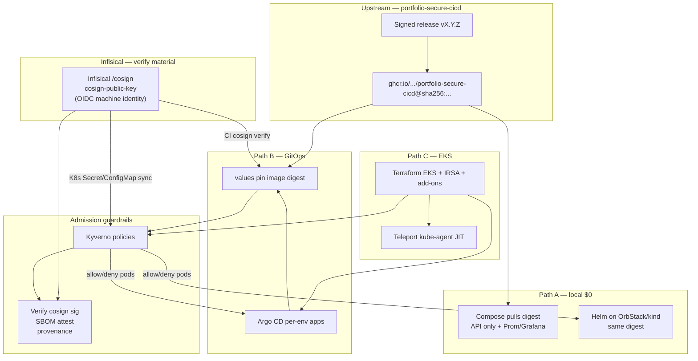

# Platform Improvement Plan — portfolio-cloud-platform

This plan is for the **infra / deploy-pack case study** in `sauravrana646/portfolio-cloud-platform`.

**Division of responsibility across portfolio demos**

| Concern | Owns it |
|---------|---------|
| Build, Trivy gates, promotion (`dev`→`uat`→`main`), cosign sign/attest, Syft SBOM, SLSA provenance, GHCR release | [`portfolio-secure-cicd`](https://github.com/sauravrana646/portfolio-secure-cicd) |
| Consume the **signed release image**, run it on Compose / Helm / Argo / EKS, enforce admission + cluster guardrails | **This repo** |

Do **not** re-implement an app release factory here. Pin and verify artifacts that secure-cicd already publishes.

Scope: **local-first + EKS**. **ECS is out of scope** (remove from Terraform and docs).

**Process:** implement only after plan approval; open implementation PRs only when the user asks.

---

## Context (current state)

| Area | Today | Gap |
|------|-------|-----|
| Workload | Local `app/api` + `app/worker` + Redis (`/work`, metrics) | secure-cicd image is a **single** Flask API (`/`, `/healthz`) — no Redis/worker. Stack here should align. |
| Images | Built in-repo; CI Trivy on local Dockerfile | Should **pull** `ghcr.io/sauravrana646/portfolio-secure-cicd` by **digest** from a release (e.g. `v0.1.0`), not rebuild the app |
| Helm | API-only chart, local image tags | Digest pin + imagePullSecrets/GHCR public pull; drop worker/Redis templates |
| Policy | None in-cluster | No Kyverno / signature / SBOM / attestation verify at admit time |
| Access | kubeconfig / AWS keys assumed | Use **Teleport** kube-agent for JIT kubectl (AWS Identity Center/SSM JIT explicitly out of scope) |
| Terraform | `local` \| `ecs` \| `eks`; EKS placeholder | Real EKS + IRSA + add-ons; ECS removed |
| GitOps | One Argo app on `HEAD` | Per-env overlays; prod pins digest + revision |
| Platform CI | pytest + build local image + helm lint + tf validate | Shift to: chart/IaC/policy gates + **cosign verify** of upstream digest; retire in-repo app build as primary path |

Upstream artifact (today): public GHCR package [`portfolio-secure-cicd`](https://github.com/users/sauravrana646/packages/container/package/portfolio-secure-cicd), release tag `v0.1.0`, signed by digest with cosign + SPDX SBOM attestation + SLSA provenance (see that repo’s release workflow).

---

## Target enterprise platform flow



**What “enterprise-like” means here**

1. **Consume, don’t rebuild** the product image — platform trusts the supply-chain case study’s digests.
2. **Admit only verified images** — Kyverno checks signature + SBOM/attestation; **cosign public key always comes from Infisical** (same project/path the release signer uses).
3. **Same chart, three runtimes** — Compose, local Helm, Argo-on-EKS.
4. **Env promotion via GitOps values** (digest bumps), not via re-releasing the app in this repo.
5. **Human JIT via Teleport** (`tsh` short-lived kube certs) — **not** AWS IAM Identity Center / SSM.
6. Workload identity via IRSA where needed; cloud remains **budget-gated**; default demo stays local.

---

## Step 0 — Scope decisions

1. **Workload alignment:** retire Redis + worker as required runtime pieces. Prefer removing `app/worker`, Redis from Compose/Helm, and `/work`-centric docs — replace with upstream API (`/`, `/healthz`). Optional: keep a thin local stub only for offline demos when GHCR is unreachable; mark it non-production.
2. **Image source of truth:** `image.repository: ghcr.io/sauravrana646/portfolio-secure-cicd`, `image.digest: sha256:…` from a published release. Tags like `:v0.1.0` may be documented for humans; **deploy by digest**.
3. **Remove ECS** from `deploy_target` (`local` \| `eks` only).
4. **No cosign private keys in this repo.** Verification uses **Infisical** as the sole source of `cosign-public-key` (OIDC machine identity). Private key + password remain only in the secure-cicd release path.
5. EKS apply stays **manual + sandbox approval**.
6. Implementation PRs only after user approval of this plan.

---

## Step 1 — Reframe docs + retire mismatched stack

| Doc / path | Change |
|------------|--------|
| `README.md` | Story: secure-cicd builds/signs → this pack deploys/verifies on Compose/Helm/Argo/EKS; drop ECS |
| `docs/architecture.md` | Digest pin + Kyverno verify + EKS guardrails |
| `docs/CASE_STUDY.md` | Platform pack that **consumes** a signed image; link secure-cicd for supply chain |
| `docs/RUNBOOK.md` | Digest bump, cosign verify failure, Kyverno block, Teleport JIT login |
| `docs/JIT_TELEPORT.md` | Teleport agent bootstrap + `tsh` demo flow |
| `SECURITY.md` | Trust boundary: upstream signatures; cluster policy; access model |
| Compose / Helm / `app/` | Align to single API image; remove Redis/worker from the **required** path (delete or quarantine under `legacy/` if useful for history) |
| Monitoring | Upstream app may lack `/metrics` — scrape what exists, or document blackbox/probes only until upstream exports metrics |

**Acceptance:** `docker compose up` pulls (or optionally builds fallback) and `curl /healthz` works without Redis.

---

## Step 2 — Helm chart: deploy upstream signed image

`charts/demo-app` becomes a thin runtime chart:

1. Deployment + Service for the API only.
2. Values:
   - `image.repository` / `image.digest` (digest wins over tag).
   - `image.tag` optional for local readability.
   - `values.yaml`, `values-staging.yaml`, `values-prod.yaml` — prod **requires** digest.
3. `securityContext`, probes on `/healthz`, resources, PDB, NetworkPolicy (uat/prod on).
4. ServiceAccount (+ optional IRSA annotation for future AWS API calls).
5. No Redis/worker templates.
6. Document GHCR pull (public package today; if private later, `imagePullSecrets`).

**Makefile**

- `cluster-deploy` uses digest from `deploy/environments/dev/images.yaml` (or values).
- `verify-image` target: fetch `cosign-public-key` from **Infisical** (CLI or documented env), then `cosign verify` + `cosign verify-attestation` on the pinned digest.

**GitOps pin workflow (human):** when secure-cicd cuts `vX.Y.Z`, update digest in `deploy/environments/*/images.yaml` via PR in **this** repo.

---

## Step 2b — Infisical for cosign **verification** (required)

Align with secure-cicd’s Infisical layout so one secrets project serves sign (upstream) and verify (this pack):

| Item | Value |
|------|--------|
| Project | Same as release signer (e.g. `devops-portfolio-x-k3-y` / `homelab-sq-te` — confirm at implement time against secure-cicd docs) |
| Secret path | `/cosign` |
| Secrets used **here** | `cosign-public-key` (**required** for verify). Do **not** fetch or mount `cosign-private-key` / `cosign-key-password` in this repo. |
| Auth | Machine identity + **OIDC** (`Infisical/secrets-action` in GitHub Actions; Infisical Kubernetes Operator or Agent on cluster) |
| Env slug | Map per runtime: e.g. CI/verify → `prod` public key (release key), or shared `/cosign` across envs if one keypair |

**Where Infisical is used**

1. **GitHub Actions** (`verify-upstream-image` job): OIDC → Infisical → export public key → `cosign verify` / `verify-attestation` on pinned `IMAGE_REF`.
2. **Makefile `verify-image`:** local operator uses Infisical CLI (`infisical run` / export) — never commit the PEM.
3. **Cluster:** Infisical Operator syncs `cosign-public-key` into a namespace Secret/ConfigMap that Kyverno `verifyImages` references. Rotation = update Infisical + re-sync; no git rewrite of key material.

Document identity IDs as GitHub Environment variables / repo variables (same pattern as secure-cicd `release` env), not as plaintext in YAML.

---

## Step 3 — Kyverno: verify signature, SBOM, attestations

Install Kyverno on local cluster (optional profile) and on EKS (required for the “enterprise” path).

Suggested layout:

```
policy/
  kyverno/
    kustomization.yaml
    install notes → Helm chart version pin in docs or terraform helm_release
    policies/
      require-signed-images.yaml      # key from Infisical-synced Secret
      require-sbom-attestation.yaml
      require-provenance-attestation.yaml   # if verifiable in-cluster
      disallow-latest-tag.yaml
      require-digest.yaml
      baseline-pod-security.yaml
      require-non-root.yaml
      readonly-rootfs.yaml
```

**Policy intent (enforce on `demo`, `demo-uat`, `demo-prod`; audit on `demo-dev` first)**

| Policy | Behavior |
|--------|----------|
| Signed images | Only allow `ghcr.io/sauravrana646/portfolio-secure-cicd` images that pass cosign verify with the **Infisical-synced** public key |
| SBOM attestation | Require SPDX SBOM attestation (type matching what secure-cicd attaches) |
| Provenance | Prefer in-cluster provenance verify when practical; else CI `cosign verify-attestation` via Infisical key + Kyverno enforce sig+SBOM first |
| No `:latest` | Deny mutable tags in uat/prod |
| Digest required | Deployments must use `@sha256:` |

**Bootstrap order:** Kyverno Helm → Infisical Operator + key sync → Teleport agent (when configured) → Kyverno policies → demo apps (App-of-Apps waves).

**Negative demo (sales):** deploy an unsigned or wrong-digest image → Kyverno blocks; contrast with pinned release digest.

---

## Step 4 — Platform CI (gates for chart, policy, IaC — not app release)

| Job | Purpose |
|-----|---------|
| `helm` | lint + template (dev/uat/prod) + kubeconform |
| `kyverno-test` | `kyverno apply` / policy tests against fixture Pods (good digest vs bad) |
| `verify-upstream-image` | On `images.yaml` changes (+ optional schedule): **Infisical OIDC** → public key → `cosign verify` + attestation verify for pinned digest |
| `terraform` | fmt-check, validate (`local` and `eks`) |
| `compose-config` | `docker compose config -q` |
| `gitleaks` / secret scan | optional cheap guard |

**Remove or demote** “build local API Dockerfile + Trivy” as the primary gate once the chart no longer builds in-repo app images. If a local fallback Dockerfile remains, scan it in a non-blocking or clearly labeled job.

No tag-release / GHCR push / Infisical cosign **signing** (private key) jobs here — verify-only.

---

## Step 5 — GitOps (Argo CD)

```
argocd/
  root.yaml
  applications/
    platform-kyverno.yaml      # policies first
    platform-teleport-agent.yaml   # Teleport kube-agent (JIT)
    demo-dev.yaml
    demo-uat.yaml
    demo-prod.yaml
deploy/environments/
  dev/values.yaml
  uat/values.yaml
  prod/values.yaml
  */images.yaml                # digest pins
deploy/platform/
  teleport-kube-agent-values.yaml
policy/kyverno/                # as above
```

- `dev`: auto-sync; Kyverno in **Audit** or softer enforce for fast demos.
- `uat`/`prod`: auto or manual sync; Kyverno **Enforce**; digest required.
- Teleport agent: **manual sync** until `proxyAddr` + join-token Secret are set.
- Prod Application `targetRevision: main` (or release git tag of *this* repo’s config) — not floating random branches.

Promotion = PR that bumps digest in env values after a secure-cicd release.

---

## Step 6 — Terraform EKS (real module, no ECS)

1. Delete ECS module and all `ecs` references.
2. EKS module (minimal, cost-aware):
   - VPC (document NAT cost).
   - Managed node group small footprint **or** Fargate — pick one; document.
   - OIDC provider + example IRSA role for the app SA (even if app needs no AWS APIs yet).
   - Add-ons: vpc-cni, coredns, kube-proxy; optional AWS LB Controller.
   - Optional: `helm_release` for Kyverno **or** leave Kyverno to Argo (prefer Argo for GitOps purity; Terraform only for cluster + critical CNI).
3. Defaults: `deploy_target=local`.
4. Makefile `apply` remains refused; destroy documented.
5. Outputs: cluster name, endpoint, OIDC, kubeconfig command.

---

## Step 7 — JIT access via Teleport (chosen)

**Decision:** human JIT = **Teleport** (`teleport-kube-agent` Helm chart in App-of-Apps).  
**Explicitly out of scope:** AWS IAM Identity Center, EKS Access Entries-as-JIT, SSM Session Manager access path.

See `docs/JIT_TELEPORT.md` for operator steps.

| Piece | Implementation |
|-------|----------------|
| Agent | Argo `platform-teleport-agent` → `teleport-kube-agent` 18.x |
| Values | `deploy/platform/teleport-kube-agent-values.yaml` (`proxyAddr`, `kubeClusterName`) |
| Join token | K8s Secret `teleport/teleport-kube-agent-join-token` (never in git) |
| Control plane | Teleport Cloud (demo) **or** optional self-hosted `teleport-cluster` later |
| Demo | `tsh login` → `tsh kube login` → time-bound `kubectl` |

### Supporting controls (still in pack; not “AWS JIT”)

| Control | Implementation sketch |
|---------|----------------------|
| Workload identity | IRSA for pods that call AWS APIs; GitHub Actions → AWS via OIDC for terraform plan |
| Network | NetworkPolicy default-deny in uat/prod |
| Secrets | Infisical Operator for cosign public key |
| Admission | Kyverno + digest/signature policies |
| Audit | EKS control plane logging when EKS is on |
| Image trust | Cosign verify with Infisical public key |

Ship: **Kyverno verify + Teleport JIT + NetworkPolicy + Infisical verify + OIDC for CI/Terraform**.

---

## Step 8 — Broader enterprise hardening (best-practice checklist)

Include or explicitly backlog with a one-line “why”:

**Cluster / workload**

- Namespace per env; ResourceQuota + LimitRange
- PodDisruptionBudget on prod API
- Readiness/liveness on `/healthz`
- `automountServiceAccountToken: false` unless needed
- Seccomp RuntimeDefault; drop all caps; non-root
- Topology spread / anti-affinity optional for prod values

**Data / config**

- External Secrets (or SOPS) pattern; `.env` gitignored for Compose
- Grafana admin password not hard-coded for shared envs

**IaC / CI**

- `terraform fmt`, validate, optional tflint + checkov/tfsec in CI
- Pin Terraform providers and Helm chart versions
- Pin GitHub Actions to SHAs over time
- Protected GitHub Environment for `terraform apply` (manual approval)

**Observability / ops**

- Compose Prom/Grafana remain local default
- On EKS: document kube-prometheus-stack or Container Insights as optional
- RUNBOOK: Kyverno block, digest rollback (revert GitOps PR), destroy EKS

**Cost / safety**

- Default local; EKS sandbox only; destroy checklist
- Makefile refuses unattended apply

---

## Step 9 — Optional AWS plan workflow

- `terraform-plan.yml`: PR + OIDC + `aws-sandbox` environment, plan comment.
- `terraform-apply.yml`: `workflow_dispatch` + required reviewers only.

Still not an app release pipeline.

---

## Step 10 — Polish & completeness (recommended add-ons)

Items that make the case study feel “finished” without changing the core story. Prioritize **P1** for the first implementation pass; **P2** after the happy path works.

### P1 — high polish, low scope creep

| Add-on | Why |
|--------|-----|
| One-command demo script (`scripts/demo.sh`) | Compose up → verify-image (Infisical) → curl healthz → optional Helm |
| `docs/DEMO_SCRIPT.md` (5–10 min talk track) | Interview / sales reproducibility |
| Before/after or “policy deny” screenshot in `docs/images/` | Shows Kyverno value instantly |
| Dependabot/Renovate for Actions, Terraform providers, Helm chart deps | Keeps the pack alive |
| `CONTRIBUTING.md` + issue/PR templates | Signals maintained project |
| Infracost or simple **cost table in README** (always-on) | Matches “cost-aware platform” pitch |
| KIND smoke job in CI (helm install + curl via port-forward) | Proves chart works without AWS |
| Golden `helm template` fixtures | Catches accidental manifest drift |
| STATUS badges (CI, policy tests) on README | Portfolio skim value |

### P2 — enterprise depth (phase after core)

| Add-on | Why |
|--------|-----|
| cert-manager + ingress-nginx (or AWS ALB) + TLS | “Real” HTTPS edge on cluster path |
| oauth2-proxy on Grafana | Zero-trust adjacent for UIs |
| Trivy Operator (in-cluster CVE continuum) | Complements admit-time cosign |
| Falco or tetragon (runtime) | Runtime threat detection story — keep optional |
| Velero (backup/restore story) | DR talking point; run once in sandbox |
| Argo Rollouts / analysis (canary) | Progressive delivery without a second product |
| OpenTelemetry Collector stub | Future-proof observability without overbuilding |
| checkov/tfsec + kube-score in CI | Extra IaC/K8s lint signal |
| ADR folder (`docs/adrs/`) | Records Teleport control-plane choice, Fargate vs node group, etc. |
| Drift detection note (Argo selfHeal + `terraform plan` on schedule) | Ops maturity |
| SBOM diff / digest changelog in `deploy/` PRs | Ties GitOps bumps to upstream releases |

### Explicitly skip (unless a client asks)

- Full Backstage / IDP portal
- Multi-cluster / multi-region
- Commercial WAF/CDN deep config
- Replacing Infisical with Vault “just because”
- Building a second app with Redis in this repo

---

## Cost model — what costs money vs free

Rough guidance for a **sandbox** account. Local-only demo stays **~$0**.

### Typically $0 for this portfolio flow

| Tool / piece | Notes |
|--------------|--------|
| Docker Compose, Helm, kubectl, OrbStack/kind/k3d | Local |
| Argo CD, Kyverno, cosign, Trivy, kubeconform, prometheus/grafana (Compose) | OSS |
| GHCR pull of public image | Free for public packages |
| GitHub Actions | Free minutes usually enough for public repos |
| **Infisical Free** | Enough for verify: machine identity + `/cosign` public key (≤5 identities). Same project as secure-cicd signer. |
| Infisical Kubernetes Operator / secrets-action OIDC | Free-tier capable for this demo |
| GitHub→AWS OIDC for terraform plan, IRSA for workloads | No extra product fee (AWS account required) |
| Teleport kube-agent | OSS chart; control plane = Cloud free/team or self-host |
| NetworkPolicy, PSS, RBAC | Native K8s |

### Costs money when you turn EKS / SaaS on

| Item | Why it costs | Ballpark (order-of-magnitude) |
|------|----------------|-------------------------------|
| **EKS control plane** | Always-on per cluster | ~$0.10/hr ≈ **~$70–75/month** |
| **Worker nodes** (managed node group) | EC2 for the demo | **~$15–40/month** for 1× small instance if left up; less if destroyed after demo |
| **NAT Gateway** (if private subnets egress) | Hourly + data | Often **~$32+/month** — largest surprise; prefer public nodes or documented NAT-less design for sandbox |
| **ALB / public LB** (optional ingress) | Hourly + LCU | **~$16+/month** if left up |
| **CloudWatch logs** (EKS audit/control plane) | Ingestion + storage | Usually small for short demos; can spike if verbose + long retention |
| **EIP / idle extras** | Easy to forget | Few $/month |
| **Teleport Cloud** (optional control plane) | SaaS proxy for agent join | Free/team often enough for demos; self-host `teleport-cluster` if you want $0 SaaS |
| **Infisical Pro+** | Only if you exceed free identities or need paid SSO features | Avoid for this demo; stay on Free |
| **Route53 / domain** (optional pretty URL) | DNS | Low; skip with localhost/port-forward |
| **Data transfer** | Cross-AZ / egress | Usually minor for demos |

### Cost guardrails (must document in README)

1. Default path = local → **$0**.
2. EKS only via explicit `deploy_target=eks` + human apply; Makefile refuses blind apply.
3. Prefer **destroy same day**; add a RUNBOOK “meter is running” checklist.
4. JIT is **Teleport**; do not add AWS Identity Center/SSM as the access story. Prefer Teleport Cloud free/team or self-hosted control plane.
5. Stay on **Infisical Free** for cosign public-key verify identities.
6. Optional: Infracost comment on Terraform PRs so cost shows before apply.

---

## Suggested implementation order (after approval)

1. Docs reframe + stack alignment (drop Redis/worker from required path; pin upstream image by digest in values).
2. Helm + Compose consume `ghcr.io/sauravrana646/portfolio-secure-cicd@sha256:…`.
3. **Infisical verify path** (Actions OIDC + Makefile) for `cosign verify` / attestations using `cosign-public-key` only.
4. Kyverno + Infisical-synced public key + policies (signature/SBOM/digest) + policy tests in CI.
5. Argo App-of-Apps (Infisical sync → policies → demo envs) + `deploy/environments/*/images.yaml`.
6. Terraform: remove ECS; real EKS; IRSA; logging; **cost table + destroy**.
7. **Teleport JIT** (kube-agent App + `docs/JIT_TELEPORT.md`) — done / harden as needed.
8. P1 polish: demo script, KIND smoke, Dependabot, screenshots, CONTRIBUTING.

---

## Validation

**Upstream trust**

- Pinned digest matches a secure-cicd GitHub Release.
- `cosign verify` and SBOM attestation verify succeed with **`cosign-public-key` from Infisical** (OIDC), not a key committed in git.
- Unsigned image deploy is **blocked** by Kyverno (EKS or local policy profile).

**Local**

- Compose/Helm run API from GHCR digest; `/healthz` OK; no Redis required.
- `make cluster-down` cleans up.

**GitOps**

- Digest bump PR updates env; Argo syncs; old digest rollback via git revert.

**EKS sandbox**

- Plan/apply (approved) brings up cluster; Kyverno + app healthy; `tsh kube login` works via Teleport agent; `terraform destroy` works.

**CI**

- Policy unit tests fail on fixtures missing signatures/digests.
- No requirement to publish images from this repo.

---

## Assumptions / open items

- secure-cicd GHCR package stays **public** (or pull credentials documented).
- Infisical project/path/env slugs and machine `identity-id` for **verify** match (or are documented alongside) the secure-cicd **sign** setup; this repo only needs read access to `cosign-public-key`.
- In-cluster verify of GitHub SLSA provenance may lag signature+SBOM; phase policies accordingly.
- JIT choice: **Teleport** (kube-agent). AWS IAM Identity Center / SSM Session Manager JIT is out of scope.
- Upstream app has no Redis and may lack Prometheus metrics — monitoring story adapts (probes + optional blackbox).
- EKS cost is real; local path must remain the default demo.

---

## Out of scope (explicit)

- Rebuilding/signing the app or storing cosign **private** keys in this repo
- Re-implementing `dev`→`uat`→`main` promotion for application code (lives upstream)
- ECS/Fargate
- **AWS JIT** (IAM Identity Center, EKS Access Entries as human JIT, SSM Session Manager access path)
- Multi-region HA, full IDP/Backstage, 24/7 managed ops
- Keeping Redis/worker as a first-class platform dependency once aligned to secure-cicd
- Paid Infisical/Teleport SaaS tiers beyond free/team unless explicitly approved
