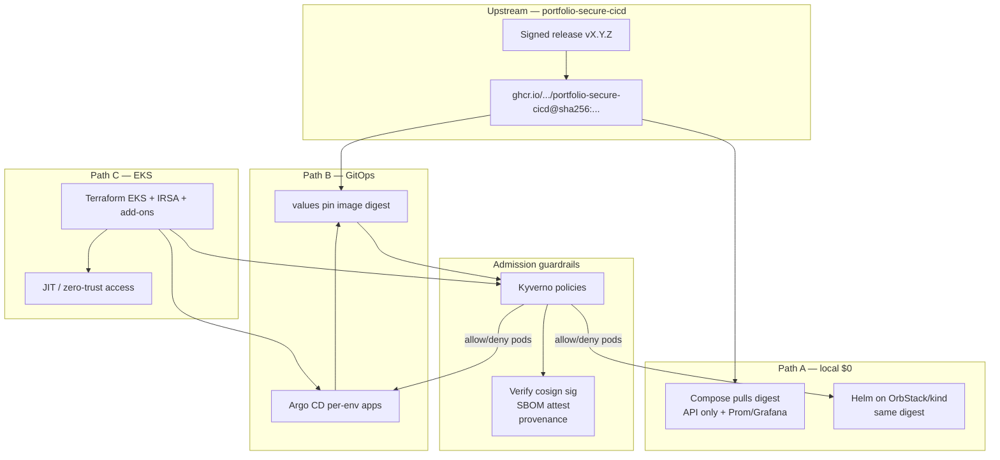

# Platform Improvement Plan — portfolio-cloud-platform

This plan is for the **infra / deploy-pack case study** in `sauravrana646/portfolio-cloud-platform`.

**Division of responsibility across portfolio demos**

| Concern | Owns it |
|---------|---------|
| Build, Trivy gates, promotion (`dev`→`uat`→`main`), cosign sign/attest, Syft SBOM, SLSA provenance, GHCR release | [`portfolio-secure-cicd`](https://github.com/sauravrana646/portfolio-secure-cicd) |
| Consume the **signed release image**, run it on Compose / Helm / Argo / EKS, enforce admission + cluster guardrails | **This repo** |

Do **not** re-implement an app release factory here. Pin and verify artifacts that secure-cicd already publishes.

Scope: **local-first + EKS**. **ECS is out of scope** (remove from Terraform and docs).

**Process:** implement only after plan approval; open implementation PRs only when the user asks.

---

## Context (current state)

| Area | Today | Gap |
|------|-------|-----|
| Workload | Local `app/api` + `app/worker` + Redis (`/work`, metrics) | secure-cicd image is a **single** Flask API (`/`, `/healthz`) — no Redis/worker. Stack here should align. |
| Images | Built in-repo; CI Trivy on local Dockerfile | Should **pull** `ghcr.io/sauravrana646/portfolio-secure-cicd` by **digest** from a release (e.g. `v0.1.0`), not rebuild the app |
| Helm | API-only chart, local image tags | Digest pin + imagePullSecrets/GHCR public pull; drop worker/Redis templates |
| Policy | None in-cluster | No Kyverno / signature / SBOM / attestation verify at admit time |
| Access | kubeconfig / AWS keys assumed | No JIT / zero-trust access story (Teleport or SSM/Identity Center pattern) |
| Terraform | `local` \| `ecs` \| `eks`; EKS placeholder | Real EKS + IRSA + add-ons; ECS removed |
| GitOps | One Argo app on `HEAD` | Per-env overlays; prod pins digest + revision |
| Platform CI | pytest + build local image + helm lint + tf validate | Shift to: chart/IaC/policy gates + **cosign verify** of upstream digest; retire in-repo app build as primary path |

Upstream artifact (today): public GHCR package [`portfolio-secure-cicd`](https://github.com/users/sauravrana646/packages/container/package/portfolio-secure-cicd), release tag `v0.1.0`, signed by digest with cosign + SPDX SBOM attestation + SLSA provenance (see that repo’s release workflow).

---

## Target enterprise platform flow



**What “enterprise-like” means here**

1. **Consume, don’t rebuild** the product image — platform trusts the supply-chain case study’s digests.
2. **Admit only verified images** — Kyverno (or equivalent) checks signature + SBOM/attestation before pods run.
3. **Same chart, three runtimes** — Compose, local Helm, Argo-on-EKS.
4. **Env promotion via GitOps values** (digest bumps), not via re-releasing the app in this repo.
5. **Access is least-privilege and time-bound** — JIT/zero-trust pattern for humans; IRSA for workloads.
6. Cloud remains **budget-gated**; default demo stays local.

---

## Step 0 — Scope decisions

1. **Workload alignment:** retire Redis + worker as required runtime pieces. Prefer removing `app/worker`, Redis from Compose/Helm, and `/work`-centric docs — replace with upstream API (`/`, `/healthz`). Optional: keep a thin local stub only for offline demos when GHCR is unreachable; mark it non-production.
2. **Image source of truth:** `image.repository: ghcr.io/sauravrana646/portfolio-secure-cicd`, `image.digest: sha256:…` from a published release. Tags like `:v0.1.0` may be documented for humans; **deploy by digest**.
3. **Remove ECS** from `deploy_target` (`local` \| `eks` only).
4. **No app release / cosign key handling in this repo** — only **verify** using the published cosign public key (document where to fetch it: release assets, Infisical public key, or `cosign` keyless notes if applicable).
5. EKS apply stays **manual + sandbox approval**.
6. Implementation PRs only after user approval of this plan.

---

## Step 1 — Reframe docs + retire mismatched stack

| Doc / path | Change |
|------------|--------|
| `README.md` | Story: secure-cicd builds/signs → this pack deploys/verifies on Compose/Helm/Argo/EKS; drop ECS |
| `docs/architecture.md` | Digest pin + Kyverno verify + EKS guardrails |
| `docs/CASE_STUDY.md` | Platform pack that **consumes** a signed image; link secure-cicd for supply chain |
| `docs/RUNBOOK.md` | Digest bump, cosign verify failure, Kyverno block, JIT access break-glass |
| `SECURITY.md` | Trust boundary: upstream signatures; cluster policy; access model |
| Compose / Helm / `app/` | Align to single API image; remove Redis/worker from the **required** path (delete or quarantine under `legacy/` if useful for history) |
| Monitoring | Upstream app may lack `/metrics` — scrape what exists, or document blackbox/probes only until upstream exports metrics |

**Acceptance:** `docker compose up` pulls (or optionally builds fallback) and `curl /healthz` works without Redis.

---

## Step 2 — Helm chart: deploy upstream signed image

`charts/demo-app` becomes a thin runtime chart:

1. Deployment + Service for the API only.
2. Values:
   - `image.repository` / `image.digest` (digest wins over tag).
   - `image.tag` optional for local readability.
   - `values.yaml`, `values-staging.yaml`, `values-prod.yaml` — prod **requires** digest.
3. `securityContext`, probes on `/healthz`, resources, PDB, NetworkPolicy (uat/prod on).
4. ServiceAccount (+ optional IRSA annotation for future AWS API calls).
5. No Redis/worker templates.
6. Document GHCR pull (public package today; if private later, `imagePullSecrets`).

**Makefile**

- `cluster-deploy` uses digest from `deploy/environments/dev/images.yaml` (or values).
- `verify-image` target: `cosign verify` + `cosign verify-attestation` against the pinned digest (public key from documented source).

**GitOps pin workflow (human):** when secure-cicd cuts `vX.Y.Z`, update digest in `deploy/environments/*/images.yaml` via PR in **this** repo.

---

## Step 3 — Kyverno: verify signature, SBOM, attestations

Install Kyverno on local cluster (optional profile) and on EKS (required for the “enterprise” path).

Suggested layout:

```
policy/
  kyverno/
    kustomization.yaml
    install notes → Helm chart version pin in docs or terraform helm_release
    policies/
      require-signed-images.yaml
      require-sbom-attestation.yaml
      require-provenance-attestation.yaml   # if verifiable in-cluster
      disallow-latest-tag.yaml
      require-digest.yaml
      baseline-pod-security.yaml            # harden PSS-adjacent rules
      require-non-root.yaml
      readonly-rootfs.yaml                  # warn or enforce where compatible
```

**Policy intent (enforce on `demo`, `demo-uat`, `demo-prod`; audit on `demo-dev` first)**

| Policy | Behavior |
|--------|----------|
| Signed images | Only allow images from `ghcr.io/sauravrana646/portfolio-secure-cicd` that pass cosign verify with the known public key |
| SBOM attestation | Require SPDX SBOM attestation (type matching what secure-cicd attaches) |
| Provenance | Prefer verify GitHub / SLSA provenance attestation where Kyverno/cosign support is practical; if in-cluster verify is awkward, document `cosign verify-attestation` in CI/Makefile and enforce signature+SBOM in Kyverno first |
| No `:latest` | Deny mutable tags in uat/prod |
| Digest required | Deployments must use `@sha256:` |

Wire Kyverno image verification to pull cosign public key from a ConfigMap/Secret created by bootstrap (public key is not sensitive; still treat rotation as a controlled change).

**Bootstrap order:** Kyverno + policies **before** app sync in Argo (App-of-Apps: `platform-policies` then `demo-*`).

**Negative demo (sales):** deploy an unsigned or wrong-digest image → Kyverno blocks; contrast with pinned release digest.

---

## Step 4 — Platform CI (gates for chart, policy, IaC — not app release)

| Job | Purpose |
|-----|---------|
| `helm` | lint + template (dev/uat/prod) + kubeconform |
| `kyverno-test` | `kyverno apply` / policy tests against fixture Pods (good digest vs bad) |
| `verify-upstream-image` | On schedule or when `images.yaml` changes: `cosign verify` + attestation verify for pinned digest |
| `terraform` | fmt-check, validate (`local` and `eks`) |
| `compose-config` | `docker compose config -q` |
| `gitleaks` / secret scan | optional cheap guard |

**Remove or demote** “build local API Dockerfile + Trivy” as the primary gate once the chart no longer builds in-repo app images. If a local fallback Dockerfile remains, scan it in a non-blocking or clearly labeled job.

No tag-release / GHCR push / Infisical cosign **signing** jobs here.

---

## Step 5 — GitOps (Argo CD)

```
argocd/
  root.yaml
  applications/
    platform-kyverno.yaml      # policies first
    platform-access.yaml       # optional JIT/agent system namespace
    demo-dev.yaml
    demo-uat.yaml
    demo-prod.yaml
deploy/environments/
  dev/values.yaml
  uat/values.yaml
  prod/values.yaml
  */images.yaml                # digest pins
policy/kyverno/                # as above
```

- `dev`: auto-sync; Kyverno in **Audit** or softer enforce for fast demos.
- `uat`/`prod`: auto or manual sync; Kyverno **Enforce**; digest required.
- Prod Application `targetRevision: main` (or release git tag of *this* repo’s config) — not floating random branches.

Promotion = PR that bumps digest in env values after a secure-cicd release.

---

## Step 6 — Terraform EKS (real module, no ECS)

1. Delete ECS module and all `ecs` references.
2. EKS module (minimal, cost-aware):
   - VPC (document NAT cost).
   - Managed node group small footprint **or** Fargate — pick one; document.
   - OIDC provider + example IRSA role for the app SA (even if app needs no AWS APIs yet).
   - Add-ons: vpc-cni, coredns, kube-proxy; optional AWS LB Controller.
   - Optional: `helm_release` for Kyverno **or** leave Kyverno to Argo (prefer Argo for GitOps purity; Terraform only for cluster + critical CNI).
3. Defaults: `deploy_target=local`.
4. Makefile `apply` remains refused; destroy documented.
5. Outputs: cluster name, endpoint, OIDC, kubeconfig command.

---

## Step 7 — Zero-trust & JIT access (human path)

Goal: show enterprise **break-glass / time-bound access**, not permanent `system:masters` kubeconfigs in laptops.

Pick **one primary demo** (keep the rest as “engagement add-ons” in docs):

### Recommended primary: Teleport (or similar) for K8s JIT

- Run Teleport (or Cloud) agent on EKS; RBAC maps SSO groups → Kubernetes groups.
- Short-lived certs for `kubectl`; session recording mentioned in CASE_STUDY.
- Local OrbStack path can skip Teleport; document “full JIT on EKS profile.”

### Strong AWS-native alternative (if Teleport is too heavy)

- **IAM Identity Center** (SSO) + EKS Access Entries / team roles.
- **SSM Session Manager** for node access (no SSH bastion).
- **No long-lived access keys**; GitHub Actions → AWS via **OIDC** for terraform plan/apply.
- Document **break-glass** role with approval + CloudTrail.

### Supporting zero-trust controls (include in pack)

| Control | Implementation sketch |
|---------|----------------------|
| Workload identity | IRSA; no static AWS keys in Secrets |
| Network | NetworkPolicy default-deny in uat/prod; optional Cilium notes |
| Ingress auth | oauth2-proxy / AWS ALB OIDC for any demo UI (Grafana) |
| Secrets | External Secrets Operator → AWS SM or Infisical (stub Interface); no plaintext prod secrets in git |
| Admission | Kyverno (above) + Pod Security `restricted`/`baseline` labels on namespaces |
| Audit | EKS control plane logging to CloudWatch; document retention |
| Image trust | Signature + SBOM attest verify |
| Supply chain at deploy | Digest pins in GitOps only |

Avoid boiling the ocean: ship **Kyverno verify + IRSA + NetworkPolicy + OIDC for CI/Terraform + one JIT story (Teleport *or* Identity Center/SSM)** in the first enterprise slice. List others as phase-2.

---

## Step 8 — Broader enterprise hardening (best-practice checklist)

Include or explicitly backlog with a one-line “why”:

**Cluster / workload**

- Namespace per env; ResourceQuota + LimitRange
- PodDisruptionBudget on prod API
- Readiness/liveness on `/healthz`
- `automountServiceAccountToken: false` unless needed
- Seccomp RuntimeDefault; drop all caps; non-root
- Topology spread / anti-affinity optional for prod values

**Data / config**

- External Secrets (or SOPS) pattern; `.env` gitignored for Compose
- Grafana admin password not hard-coded for shared envs

**IaC / CI**

- `terraform fmt`, validate, optional tflint + checkov/tfsec in CI
- Pin Terraform providers and Helm chart versions
- Pin GitHub Actions to SHAs over time
- Protected GitHub Environment for `terraform apply` (manual approval)

**Observability / ops**

- Compose Prom/Grafana remain local default
- On EKS: document kube-prometheus-stack or Container Insights as optional
- RUNBOOK: Kyverno block, digest rollback (revert GitOps PR), destroy EKS

**Cost / safety**

- Default local; EKS sandbox only; destroy checklist
- Makefile refuses unattended apply

---

## Step 9 — Optional AWS plan workflow

- `terraform-plan.yml`: PR + OIDC + `aws-sandbox` environment, plan comment.
- `terraform-apply.yml`: `workflow_dispatch` + required reviewers only.

Still not an app release pipeline.

---

## Suggested implementation order (after approval)

1. Docs reframe + stack alignment (drop Redis/worker from required path; pin upstream image by digest in values).
2. Helm + Compose consume `ghcr.io/sauravrana646/portfolio-secure-cicd@sha256:…`; Makefile `verify-image`.
3. Kyverno install manifests + policies (signature/SBOM/digest) + policy tests in CI.
4. Argo App-of-Apps (policies then demo envs) + `deploy/environments/*/images.yaml`.
5. Terraform: remove ECS; real EKS; IRSA; logging; cost docs.
6. JIT/zero-trust slice (Teleport **or** Identity Center/SSM + EKS access entries) + SECURITY/RUNBOOK.
7. Platform CI finalization (kyverno-test, cosign verify on pin changes, tfsec/checkov optional).
8. Polish: quotas, PSS labels, External Secrets stub, Grafana auth note.

---

## Validation

**Upstream trust**

- Pinned digest matches a secure-cicd GitHub Release.
- `cosign verify` and SBOM attestation verify succeed with documented public key.
- Unsigned image deploy is **blocked** by Kyverno (EKS or local policy profile).

**Local**

- Compose/Helm run API from GHCR digest; `/healthz` OK; no Redis required.
- `make cluster-down` cleans up.

**GitOps**

- Digest bump PR updates env; Argo syncs; old digest rollback via git revert.

**EKS sandbox**

- Plan/apply (approved) brings up cluster; Kyverno + app healthy; JIT path can request short-lived access; `terraform destroy` works.

**CI**

- Policy unit tests fail on fixtures missing signatures/digests.
- No requirement to publish images from this repo.

---

## Assumptions / open items

- secure-cicd GHCR package stays **public** (or pull credentials documented).
- Cosign **public** key availability for verify (release notes, repo docs, or Infisical public material) — confirm exact distribution path with the secure-cicd release layout.
- In-cluster verify of GitHub SLSA provenance may lag signature+SBOM; phase policies accordingly.
- Teleport vs AWS-native JIT: **user picks one** before implementation Step 7.
- Upstream app has no Redis and may lack Prometheus metrics — monitoring story adapts (probes + optional blackbox).
- EKS cost is real; local path must remain the default demo.

---

## Out of scope (explicit)

- Rebuilding/signing the app or storing cosign **private** keys in this repo
- Re-implementing `dev`→`uat`→`main` promotion for application code (lives upstream)
- ECS/Fargate
- Multi-region HA, full IDP/Backstage, 24/7 managed ops
- Keeping Redis/worker as a first-class platform dependency once aligned to secure-cicd
