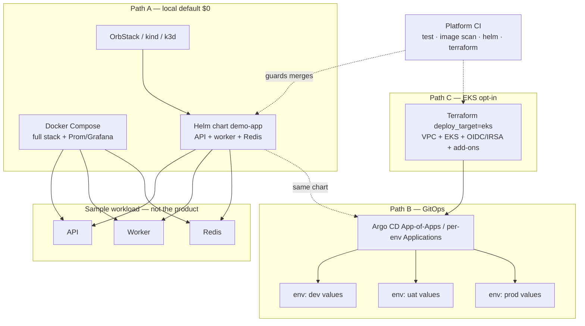

# Platform Improvement Plan — portfolio-cloud-platform

This plan is for the **infra / deploy-pack case study** in `sauravrana646/portfolio-cloud-platform`. The demo Flask API + worker are only a **sample workload** so Compose, Helm, GitOps, and EKS have something real to run.

**This is not a supply-chain / release case study.** Promotion branches (`dev`→`uat`→`main`), GHCR signed releases, cosign, SBOM attestation, and Infisical key material belong in [`portfolio-secure-cicd`](https://github.com/sauravrana646/portfolio-secure-cicd) (see [`devops-portfolio` `docs/CICD_IMPROVEMENT_PLAN.md`](https://github.com/sauravrana646/devops-portfolio/blob/main/docs/CICD_IMPROVEMENT_PLAN.md)). Do **not** copy that release model here unless a later engagement explicitly joins the two demos.

Scope for this plan: **local-first + EKS**. **ECS is out of scope** and should be removed from Terraform and docs.

---

## Context (current state)

| Area | Today | Gap vs enterprise platform pack |
|------|-------|----------------------------------|
| Workload | API + Redis worker; Redis list `jobs` | Fine as a stub; Helm does not deploy worker/Redis so cluster path is incomplete |
| Local | Compose: API, worker, Redis, Prometheus, Grafana | Good 15-min demo; Grafana default password; no documented parity checklist vs Helm |
| Helm | API Deployment + Service; staging PDB/NetworkPolicy | API-only; missing worker, Redis, ServiceAccount, ConfigMap pattern, prod values, securityContext |
| GitOps | One Argo CD Application on chart `HEAD` | No env overlays; prod should not float on `HEAD` |
| Terraform | `local` \| `ecs` \| `eks`; EKS is `null_resource`; ECS skeleton | No real EKS; ECS still pitched; no IRSA / add-ons / cost notes for a sandbox cluster |
| CI | pytest, API image+Trivy (no push), helm lint, tf validate | Enough as a **platform gate** (lint/validate); missing worker image scan, `helm template`+kubeconform, tf fmt/tflint, compose config check |
| Make / runbook | Compose + `cluster-deploy` on current kubecontext; `apply` refused | No EKS bootstrap/teardown targets; RUNBOOK weak on cluster/EKS failure modes |
| Narrative | README/CASE_STUDY still sell ECS as cheap cloud | Should sell **local → Helm → Argo → EKS (budget-gated)** |

---

## Target enterprise platform flow



**What “enterprise-like” means here**

1. One chart, three runtimes: Compose parity locally, Helm on a laptop cluster, same chart synced by Argo on EKS.
2. Env separation via **values overlays** (`dev` / `uat` / `prod`), not via a separate app-release factory.
3. Cloud is a **gated Terraform module** (`deploy_target=eks`), never the default, with cost and destroy called out.
4. CI proves the **pack is safe to merge** (tests, image CRITICAL gate, helm render/lint, terraform validate) — it does not need to publish signed product releases.

Images used on EKS can be locally built, pulled from a public demo tag, or (optional, thin) pushed to GHCR **without** cosign/SBOM/changelog ceremony — point consumers at the secure-cicd repo for that story.

---

## Step 0 — Scope decisions

Record in the implementing PR:

1. **Remove ECS** from `deploy_target`, modules, README, CASE_STUDY, SECURITY, architecture.
2. **Keep the sample app minimal** — no product features; only changes that unblock platform (e.g. `/readyz` if Redis readiness matters).
3. **GitOps in-repo:** `deploy/environments/{dev,uat,prod}/` (or `charts/demo-app/values-*.yaml` + `argocd/` apps). No second gitops repo unless requested.
4. **No promotion-branch / tag-release / cosign work** in this repo’s critical path.
5. EKS `terraform apply` remains **manual + sandbox approval**; Makefile continues to refuse blind apply.

---

## Step 1 — Reframe docs (narrative first)

Update messaging before large infra code:

| Doc | Change |
|-----|--------|
| `README.md` | Mermaid: Compose → Helm (local context) → Argo → EKS; drop ECS; clarify sample workload vs platform pack |
| `docs/architecture.md` | `deploy_target`: `local` \| `eks` only; env overlays; cost gate |
| `docs/CASE_STUDY.md` | Problem/approach/results as **K8s deploy pack**; out-of-scope: supply-chain signing (link other case study), multi-region, full IDP |
| `docs/RUNBOOK.md` | Compose + Helm + (later) EKS/Argo sections |
| `SECURITY.md` | Local/EKS sandbox; OIDC for AWS if plan/apply added; no ECS |
| `infra/terraform/README.md` | Align with EKS-only cloud path |

---

## Step 2 — Helm chart = Compose parity (core platform deliverable)

`charts/demo-app` should deploy the same app path Compose runs:

1. API Deployment + Service (existing).
2. Worker Deployment (same image build context as `app/worker`).
3. Redis (simple in-chart Deployment/Service for demo; document “use managed Redis in real prod”).
4. ConfigMap for non-secret config; `REDIS_URL` wired for API + worker.
5. ServiceAccount; optional IRSA annotation values for EKS later.
6. `securityContext` (non-root, drop caps, readOnlyRootFilesystem where feasible).
7. Values:
   - `values.yaml` — local / laptop cluster
   - `values-staging.yaml` — replicas, PDB, NetworkPolicy on (extend existing)
   - `values-prod.yaml` — stricter defaults for the prod overlay story
8. NetworkPolicy: allow API ingress, API→Redis, worker→Redis, metrics scrape as needed.
9. Optional HPA behind a flag — nice-to-have, not blocking.

**Makefile:** `cluster-deploy` installs the full stack; `cluster-status` shows deploy/svc/pdb/netpol; keep `cluster-down`.

**Acceptance:** after `make cluster-deploy`, `/work` can enqueue and the worker can consume (Redis in-cluster), matching Compose behavior.

---

## Step 3 — Platform CI (validate the pack, don’t “release” the app)

Evolve `.github/workflows/ci.yml` as a **merge gate for infra + chart + smoke app tests**:

| Job | Purpose |
|-----|---------|
| `test-api` | Existing pytest |
| `test-worker` | Small worker test (mock Redis) so the workload does not rot |
| `image-api` / `image-worker` | Build + Trivy CRITICAL (still `push: false` unless a later optional GHCR step is needed for EKS demos) |
| `helm` | `helm lint` + `helm template` for local/staging/prod values + **kubeconform** (or equivalent) |
| `terraform` | `fmt -check`, `init -backend=false`, `validate` (local + eks var files if validate-clean without creds) |
| `compose-config` | `docker compose config -q` |

Triggers can stay `push`/`pull_request` on `main` (and PRs). **No** requirement for `dev`/`uat` long-lived promotion branches in this case study.

Optional later: `workflow_dispatch` Terraform plan against AWS OIDC — still not a release pipeline.

---

## Step 4 — GitOps layout (Argo CD)

Replace the single HEAD Application with an enterprise-shaped but still demo-sized layout:

```
argocd/
  root.yaml                 # optional App-of-Apps
  applications/
    demo-dev.yaml
    demo-uat.yaml
    demo-prod.yaml
deploy/environments/
  dev/values.yaml
  uat/values.yaml
  prod/values.yaml
```

Conventions:

- All apps point at **this chart**; differ only by values and destination namespace (`demo-dev`, `demo-uat`, `demo-prod`).
- `dev`: automated sync + selfHeal (playground).
- `uat` / `prod`: automated or manual sync per taste; **prod must not track floating `HEAD` of arbitrary branches** — pin to `main` (or a known revision) and values that do not use `:latest` once images are stable.
- Document bootstrap: install Argo on OrbStack/kind **or** on EKS after Terraform; `kubectl apply -f argocd/`.

This is the GitOps story hiring managers expect from a platform pack — env promotion via **merged values changes**, not via a product release workflow.

---

## Step 5 — Terraform: real EKS, delete ECS

1. Remove `modules/ecs` and all `ecs` branches in `main.tf` / variables / outputs / docs.
2. Replace `modules/eks` `null_resource` with a **minimal real module**:
   - Reuse/extend VPC (call out public subnets + NAT cost if required).
   - EKS cluster + small managed node group (e.g. desired 1, max 2, cost-aware instance type) **or** a single Fargate profile — pick one and document why.
   - Cluster OIDC provider for IRSA.
   - Add-ons: vpc-cni, coredns, kube-proxy; note AWS LB Controller as follow-on.
   - Outputs: cluster name, endpoint, OIDC ARN, kubeconfig command.
3. Keep default `deploy_target=local` (no AWS resources).
4. Keep Makefile `apply` refusal; document sandbox-only apply + destroy.
5. `terraform.tfvars.example` with `deploy_target = "local"`.
6. README cost table: local $0; EKS sandbox ballpark + “destroy when done”.

CI continues to **validate**; it does not apply.

---

## Step 6 — Optional AWS plan workflow (still not a release)

Only if demonstrating enterprise IaC PR flow:

- `terraform-plan.yml` on PRs that touch `infra/**`, using GitHub OIDC → AWS role, environment `aws-sandbox`, plan comment on PR.
- `terraform-apply.yml` as `workflow_dispatch` + required reviewer — never on push to `main`.

No tag-driven release job. No cosign. No changelog automation.

---

## Step 7 — Observability & runbooks (platform ops)

- Keep Compose Prometheus/Grafana as the zero-cost observability story.
- Add a simple Grafana dashboard JSON under `monitoring/dashboards/` for `demo_api_requests_total`.
- For cluster: document scrape annotations or ServiceMonitor if someone installs kube-prometheus-stack; do not require a full observability stack inside the chart for v1.
- RUNBOOK additions: ImagePullBackOff with in-cluster Redis, Argo sync stuck, EKS kubeconfig, `terraform destroy`, Helm rollback.
- Optional app tweak: `/readyz` fails when Redis is configured but unreachable (better K8s readiness).

---

## Step 8 — Security baseline (cluster-focused)

- Chart `securityContext` + NetworkPolicy on for uat/prod values.
- Non-root images (already); scan both API and worker in CI.
- Compose: document overriding Grafana admin password via `.env` (gitignored).
- Prefer OIDC over static AWS keys for any Terraform workflow.
- Explicitly defer image signing / SBOM / provenance to the secure-cicd case study (one sentence + link in CASE_STUDY / README).

---

## Suggested PR slices

1. Docs reframe + ECS deprecation (this plan + README/architecture/case study).
2. Helm full stack (API + worker + Redis) + Makefile/RUNBOOK parity.
3. Platform CI expansion (worker test, both images, kubeconform, tf fmt).
4. Argo per-env apps + `deploy/environments/*` overlays.
5. Terraform: remove ECS; real EKS module; cost/destroy docs.
6. Optional: OIDC terraform plan; observability dashboard; `/readyz`.

---

## Validation

**Local**

- `docker compose up --build -d` → healthz/work/metrics.
- `make cluster-deploy` → API + worker + Redis Ready; work enqueues end-to-end; `make cluster-down` cleans up.

**CI**

- PR fails on CRITICAL image vulns, bad Helm render, or invalid Terraform.
- PR does **not** need GHCR push, cosign, or GitHub Releases to be “green.”

**GitOps**

- Applying Argo apps creates three namespaces/apps with distinct values; changing a values file is the promotion mechanism.

**EKS (sandbox, manual)**

- `terraform plan -var='deploy_target=eks'` shows a real cluster plan.
- Approved apply → kubectl + Argo sync sample workload.
- `terraform destroy` tears down; docs warn about cost.

**Negative**

- `make apply` still refuses.
- No ECS module/paths remain.

---

## Assumptions / open items

- Sample workload stays intentionally small; polish goes into chart, GitOps, and Terraform.
- EKS is optional; CI and the 15-minute demo must work with **zero AWS**.
- Branch protection on `main` (PR + CI green) is enough; multi-stage git promotion is **out of scope** here.
- Managed Redis, multi-AZ NAT, ALB/WAF, and Kyverno/OPA are follow-ons — mention as “what a real engagement adds,” not v1 blockers.
- If a future demo must pull images on EKS from GHCR, a thin “build & push on `main`” job is acceptable; keep it clearly secondary to the platform story and unsigned unless cross-linking secure-cicd.

---

## Out of scope (explicit)

- App release trains, semver tags, cosign, SBOM attestation, SLSA provenance, Infisical cosign keys
- `dev` / `uat` / `main` promotion-guard workflows (other case study)
- ECS / Fargate path
- Multi-region HA, full IDP (Backstage), 24/7 managed ops
- Turning the Flask stub into a real product
